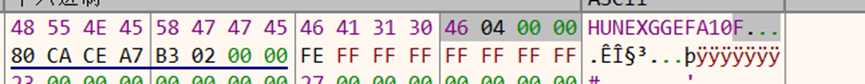
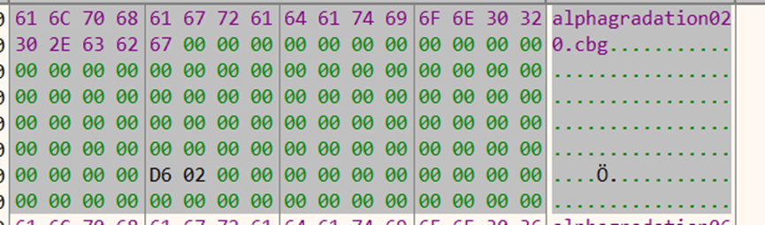
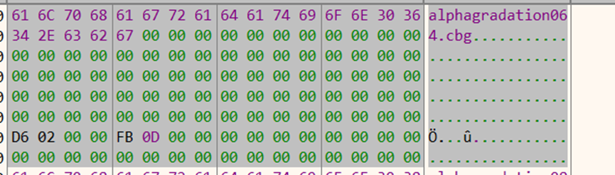
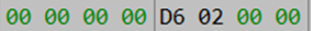
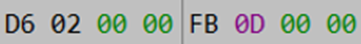
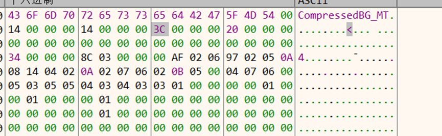

# Magic

​                               

第四个dword 0x446为文件个数

 

第一个dword为偏移 第二个dword为读取数

# CompressedBG_MT

​                               

34 00 00 00偏移 

14 00 00 00 

14 00 00 00 分别为宽和高

20 00 00 00是分辨图片是 RGBA 还是 RGB 的