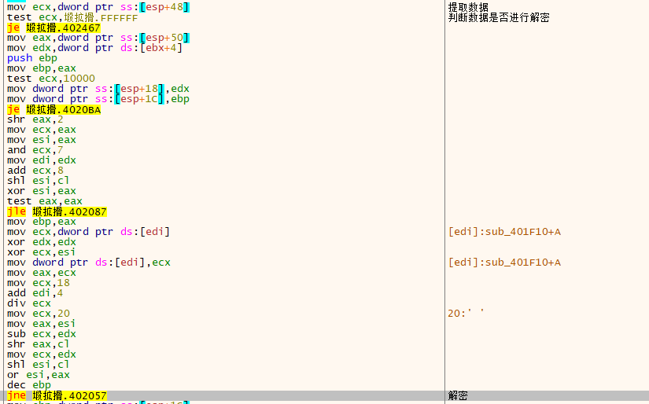
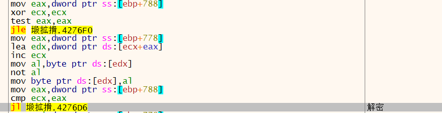

### 解包ロケットの夏～Full Voice Version～

读取2个dword 文件头进行判断

第二个dword ？

第三个  dword 为文件数 做为文件读取数据 循环判断

文件名相同则跳出文件读取循环

将E02E90作为偏移

30010000判断   数据进行解密方式

将67236作为读取字节数

开辟空间 读取数据

第一种解密

解密数据 获取文件

————————————————

第二种解密

