### 解包ロケットの夏～Full Voice Version～

读取2个dword 文件头进行判断

第二个dword ？

第三个  dword 为文件数 做为文件读取数据 循环判断

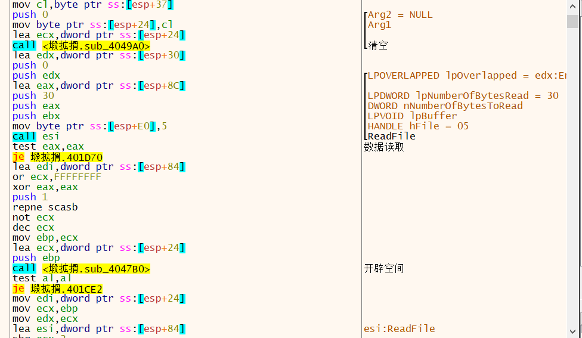

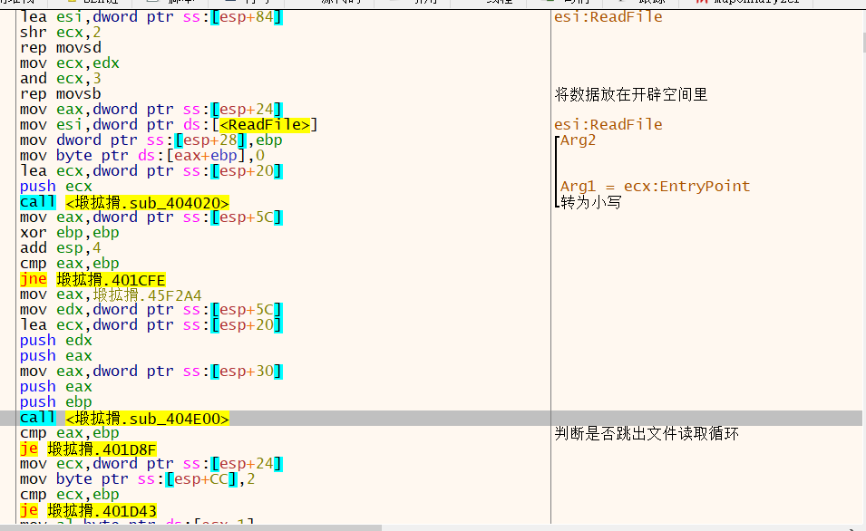

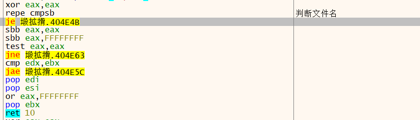

文件名相同则跳出文件读取循环

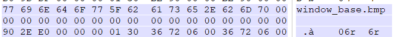

将E02E90作为偏移

30010000作为判断 

将67236作为读取字节数

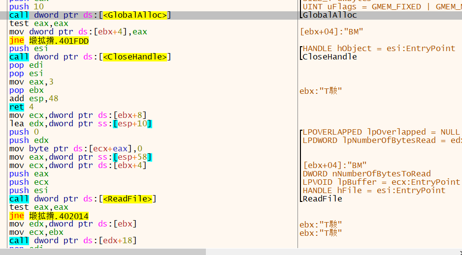

开辟空间 读取数据

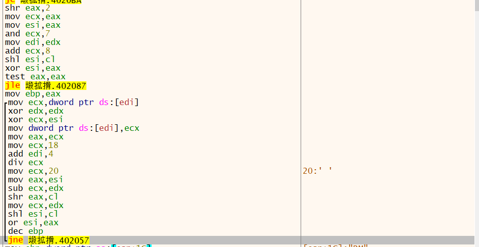

对数据进行操作

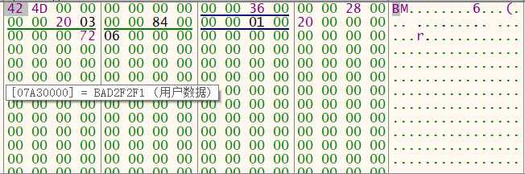

解密数据 获取文件

————————————————

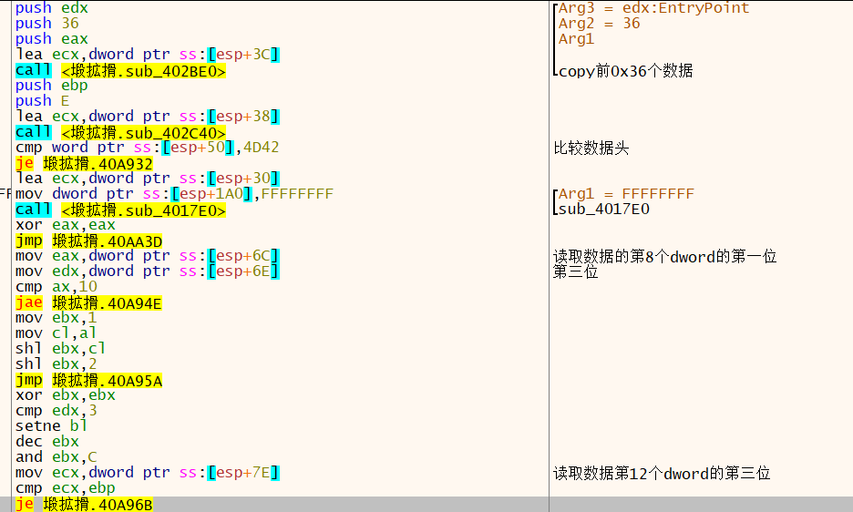

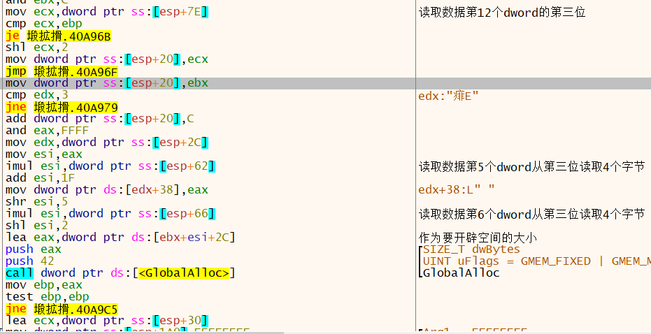

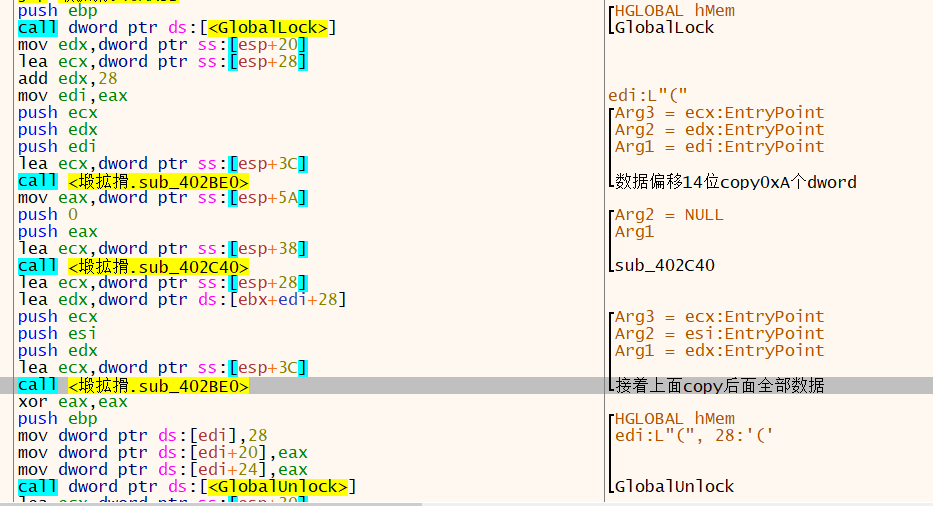

最后数据结构存储为

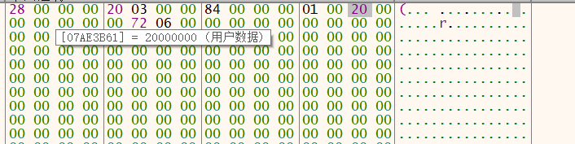

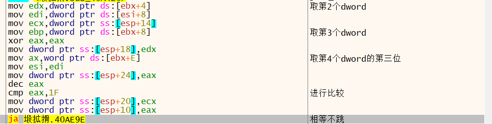

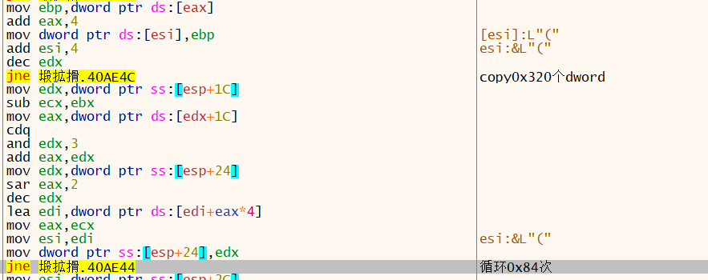

从后往前copy