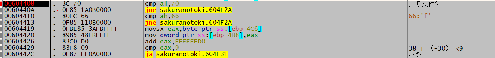
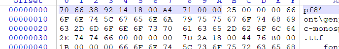
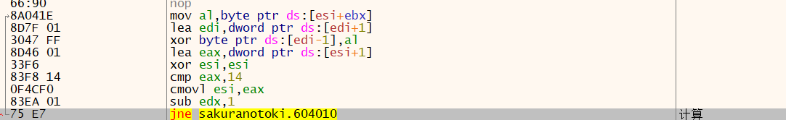
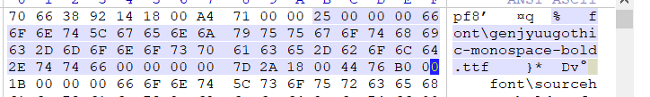

## 解包サクラノ刻 −櫻の森の下を歩む−

### 调试程序

开始调试程序 分析是这样对*.pfs进行读取的

文件读取主要使用3个API-CreateFile，SetFilePointer和ReadFile 分别对其下个断点

读取0x1000数据并进行文件头判断

181492指向数据偏移

71A4为文件数量

对文件进行解密

数据结构为

第一个DWORD为文件路径大小 

char[]文件名

倒数第三个DWORD全0 

倒数第二个DWORD 为文件数据偏移

倒数第一个DWORD 为文件数据大小