## 解包片恋いの月——简单分析Galgame汉化中的逆向


### 文件分析

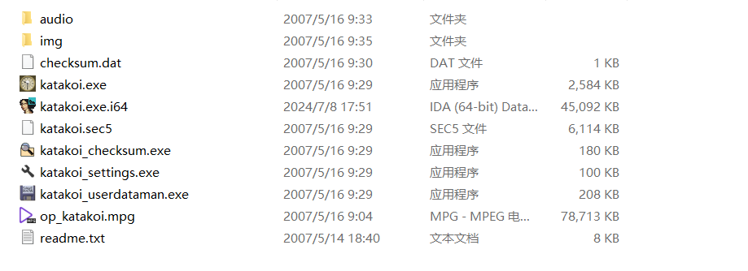

文件夹很清晰 可以看出文本是放在*.sec5中的

### 调试程序

开始调试程序 分析是这样对*.sec5进行读取的

文件读取主要使用3个API-CreateFile，SetFilePointer和ReadFile 分别对其下个断点，最后发现该程序并未调用SetFilePointer

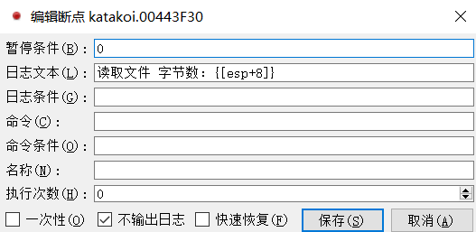

重新调试程序 并对ReadFile进行条件断点

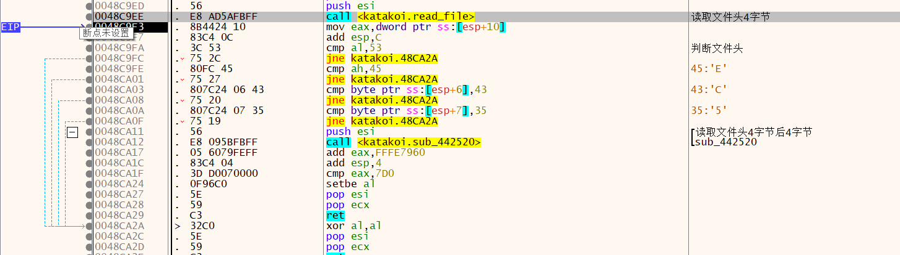

程序最先会读取文件头4个字节 并判断是否为SEC5

紧接着会再读取4个字节并做判断

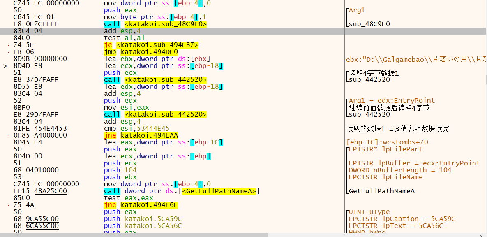

读取数据1作为数据类型的标志，读取数据2作为读取后面数据的大小

这里可以分析出该数据结构体可以写为

```c++
struct Data
{
    char sign[4];
    unsigned long size;
}data;
char* Buf = malloc(data.size);
```


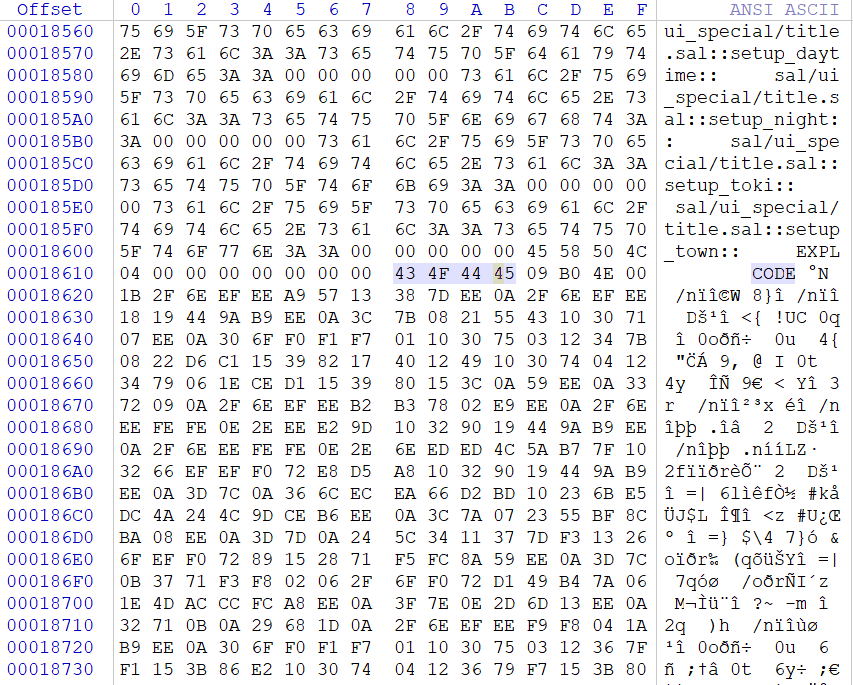

十六进制查看会发现code后面的数据与前面不同可以明显看出该地方就是文本数据，后面4EB009就是他文本数据的大小

在日志中看到

从这里开始继续跟进

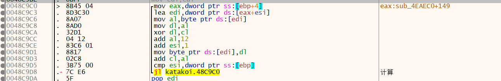

发现这里是对文件做处理解密

```c++
__asm
    {
        mov edi, fileBuf
        xor ecx, ecx
        xor esi, esi
        mov edx, 4EB009h
calc:
        mov al, byte ptr ds:[edi + esi]
        mov dl, al
        xor dl, cl
        add al, 0x12
        mov byte ptr ds : [edi + esi], dl
        add esi, 1
        add cl, al
        cmp esi, edx
        jl calc
    }
```


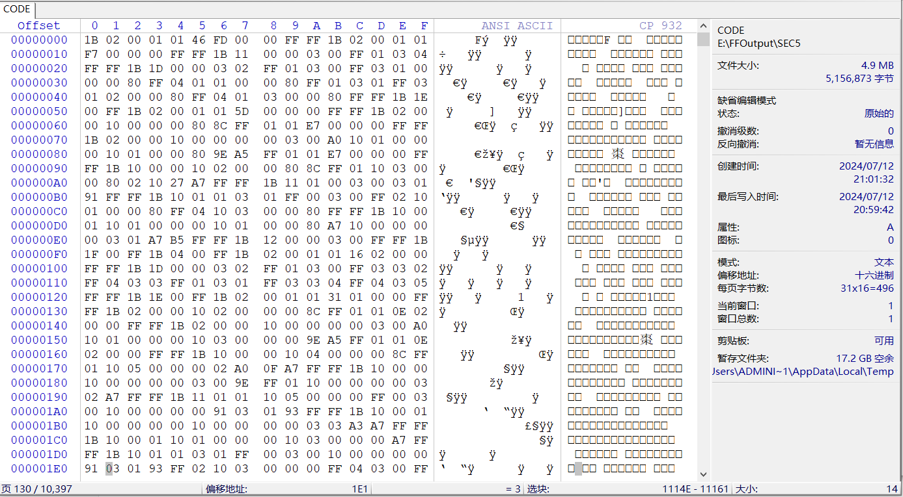

解析后文件分析 1B为标志  后面~~FD46~~(进行一定的计算)为下一个1B的偏移

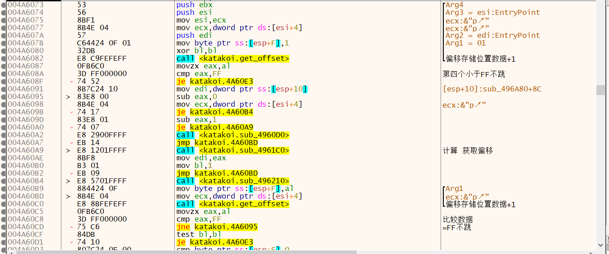

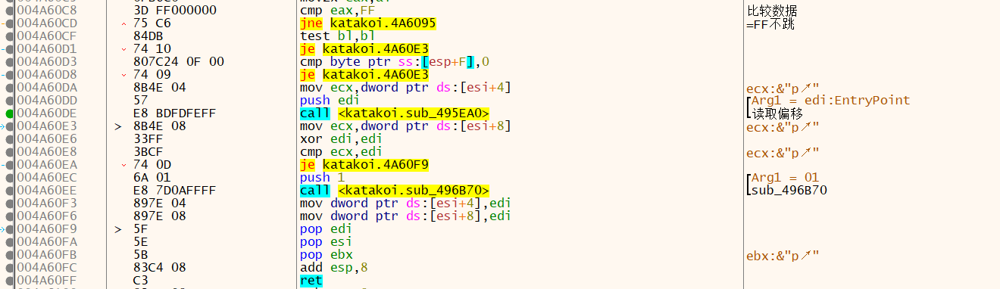


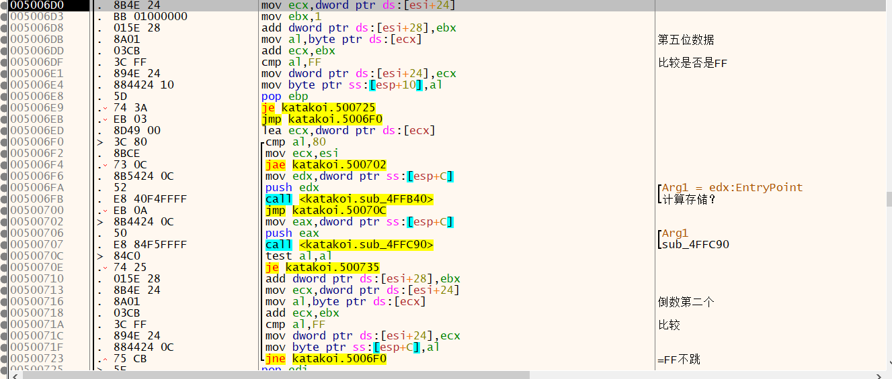


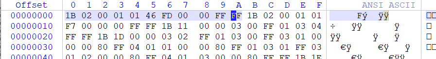

首先读取标志1B    位置为1

在读取第四位与FF判断 位置为4

在读取第五位与FF判断  第五位=1  读取DOWRD数据  为3读取byte数据  为2 读取word数据

读取后面4字节数据FD46

 读取倒数第二位判断是否为FF

读取倒数第一位是否为FF

在修改文本时要改的偏移

分析发现这些地址是写死了的


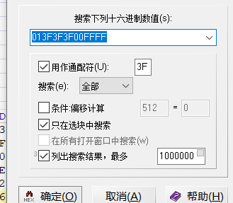

定义选块为文本结束   模糊搜索格式标志    

if 偏移大于文本结束位置偏移   

​	偏移 - 新CODE与旧CODE大小的差


//TODO
